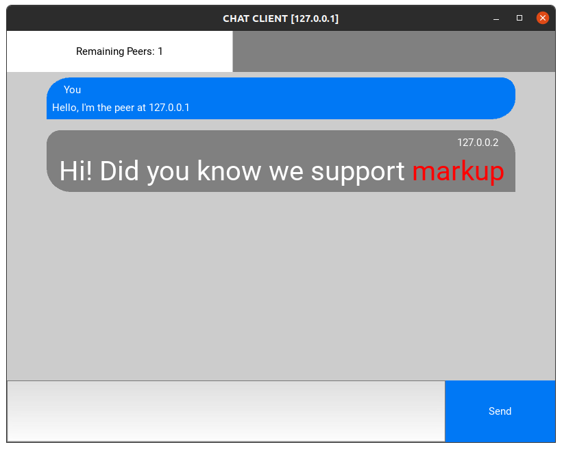
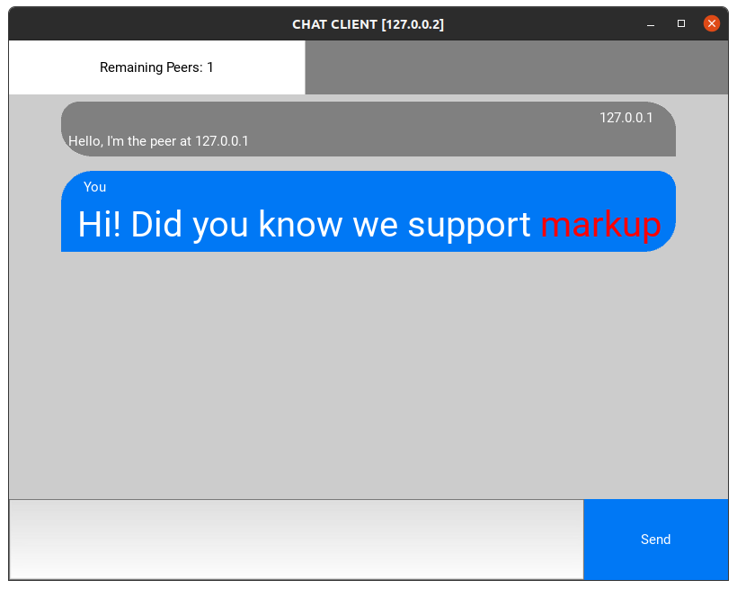

# Dynamic Vector Clocks - Reliable, causally ordered peer-to-peer communication 

## Authors

Author Name  | Email                           |
-------------|---------------------------------|
Joel Kenna   | jfkenna@student.unimelb.edu.au  |
James Sammut | j.sammut@student.unimelb.edu.au |

## Contents

This **peer to peer**, **decentralized** application uses [**Dynamic Vector Clocks**](https://vs.inf.ethz.ch/edu/HS2016/VS/exercises/A3/DVC_Landes.pdf) to provide functionality expected from resilient multi-tenant chat applications, namely the ability to:
- **RELIABLY** deliver messages, even with peer failure - if even one peer remains alive in the network, all non-crashed peers will eventually receive all sent messages
- **CAUSALLY** deliver messages - messages will always be delivered to all peers in a [causal order](https://en.wikipedia.org/wiki/Vector_clock#Partial_ordering_property). If a message causally preceeds another message (even via some complex multi-peer causal chain), all peers will receive the predecessor before any successors
- **DYNAMICALLY** grow and shrink the network as peers fail, leave chats, or join chats (this is a step beyond standard fixed-size vector clock algorithms)

The "killer feature" of our application is that it enforces reliable, causal message delivery while being fully peer-to-peer - the system can guarantee messages are always displayed _to all peers_ in an order that makes sense and captures all inter-message dependencies without relying on a central coordinating server. This is a critical feature - in standard chat applications, there's a real chance clients _may_ receive messages out-of-order due to heavy load, high retransmit costs, or network congestion. We make use of DVCs with reliable broadcast to ensure that messages are always delivered to _all_ peers according to a causal ordering, even if they're received by the client out of order.

While the main focus of this application is to provide a practical demonstration of an advanced logical time algorithm for distributed systems (the **Dynamic Vector Clock**), we have also provided a simple GUI for convenience. The GUI provides basic quality of life features, including:

- The ability to markup messages to style their size, text colour, boldness, etc.
- Basic indicators of active connected peers (top left corner)
- Notifications when a peer is completely severed from the network (top right corner)

The images below show two peers that have just exchanged messages. The peer at `127.0.0.2` has added styling to their message by sending `[size=50]Hi! Did you know we support [color=ff0000]markup[/color][/size]`.




## Invocation Instructions

The application can be run in two ways: a central peer registry server can be used to provide an initial peer set to clients OR peer ips can be manually entered at launch. Instructions for both cases are provided below.

### .env parameters

Before starting the application, make sure you have provided values for the following .env params:  

- `CLIENT_WORKER_THREADS`: the number of threads a client will use to handle message sends, replies, and rebroadcasts.
- `PROTOCOL_PORT`: The port number that a client/peer will use for p2p communication
- `REGISTRY_PROTOCOL_PORT`: The port number used to communicate with the peer registry server (ONLY REQUIRED IF RUNNING WITH A REGISTRY SERVER)
- `ENABLE_PEER_SERVER`: Whether to enable the peer registry server. When disabled, clients must manually enter the ips of their peers. Takes values of 0 (disabled) or 1 (enabled).
- `ENABLE_NETWORK_DELAY`: Whether to enable simulated networking delay. Takes values of 0 (disabled) or 1 (enabled).
- `MOCK_NETWORK_DELAY`: The amount of time the simulated delay should last for. Value should be provided in seconds. (ONLY REQUIRED IF RUNNING WITH A REGISTRY SERVER)

**Note:** For macOS users, the extension of the local loopback IP addresses beyond `127.0.0.1` may be required. If running the application on macOS based machine, ensure that additional local IPs beyond this address are able to be set.

### Running without a Peer Registry Server

Clone the repo and ensure that in the `.env` file, `ENABLE_PEER_SERVER` is set to `0` (this is the default value).

From there - you'll need to invoke a new client/peer via `client.py` with a specific IP address that it should listen on. For example - below is starting up a client/peer with `127.0.0.1` as its listening IP:

```
python3 client.py 127.0.0.1
```

The running client/peer will then prompt the user to enter the ip / hostnames of the peers to connect to. After keying in the address of a peer, press enter to begin entering the details of a new peer. Once all peers you wish to connect to have been entered, enter `f` or `finished` to connect to the network. **N.B:** A peer does not need to know / connect to all other peers in the network - as long as the network is a connected graph, there will be a path for messages between any two peers.

Once the client has connected to at least one other peer, a local Kivy window will appear where the user can begin chatting with peers. 

### Running with a Peer Registry Server

Clone the repo and ensure that in the `.env` file, `ENABLE_PEER_SERVER` is set to `1` to enable the central peer registry server. You might want to also change its port via `REGISTRY_PROTOCOL_PORT` in `.env`.

From there - you'll need to start the server **first** by `server.py` with a specific IP address that it should should listen on. For example - below is starting up the server with `127.0.0.1` as its listening IP:

```
python3 server.py 127.0.0.1
```

The server will then start up and start listening on the respective IP and port specified:

```
╰─ python3 server.py 127.0.0.1
Server listening at 127.0.0.1 on port 9877
```

From here - similar to the case where clients/peers connect without a central peer registry server, new clients/peers will need to be started and thus will register with the server and join the network. Unlike the above though, `client.py` now expects **two** arguments: the first as the client/peer's IP, and the second as the server's IP. For example - starting a client/peer with address `127.0.0.2` connecting to the central peer registry server at `127.0.0.1`: 

```
python3 client.py 127.0.0.2 127.0.0.1
```

Running the above will map this client/peer's IP: and based on if this is the first peer (or not) as explored in the [invocation](#invocation-1) section will either register with the server and await new client/peer connections - or say `hello` to all other client/peers (message merging) and then register itself with the server (and thus network). There is **no need** to specify IPs for other client/peers in this scenario - as this is the job of the server to direct to client/peers that join in at any time.

Once connected, the client will appear identical to no-peer registry server flow.


### Running with simulated network delay

The simulated network delay option is used for debugging and for demonstrating the causal delivery guarantees of the application.

To simulate network delay for communication between processes, the following changes are required in the `.env` file.
- `ENABLE_NETWORK_DELAY` should be set to `1`
- `MOCK_NETWORK_DELAY` should be set to a reasonable delay. I found `5` seconds allowed the delay to be clearly observed without making me too impatient.

The client can then be invoked as per the instructions for running without the peer registry server, except that an additional argument should be provided to specifiy the IP whose messages should be delayed. For instance, to run the client at `127.0.0.1` while simulate the delay of messages from `127.0.0.2`, use the following command:

```
python3 client.py 127.0.0.1 127.0.0.2
```

I have found that the easiest way to test causal delivery is functioning as expected is as follows:
1. Run a client at `127.0.0.1` and `127.0.0.2`, with both throttling some unused address (e.g. `127.0.0.99`)
2. Run another client at `127.0.0.3` that delays messages from `127.0.0.1`. 
3. You can then send a message from `127.0.0.1`, then send another from `127.0.0.2` once the first message is received.
4. The client at `127.0.0.3` will not be able to receive the message from `127.0.0.2` until the delayed message from `127.0.0.1` is finally received (after a 5 second delay), as `127.0.0.2`'s message is causally dependant on the delayed message.


### Running with a Peer Registry Server AND network delay

If you intend to run with both a registry server and a network delay, you must specify the client ip, then the server ip, then the throttled ip. For example, to run a client at `127.0.0.2` with a registry server at `127.0.0.1` and a throttled ip at `127.0.0.99`, use the following command:

```
python3 client.py 127.0.0.2 127.0.0.1 127.0.0.99
```

Note that `.env` params should be configured as per the instructions in the network delay and registry server sections of the readme.